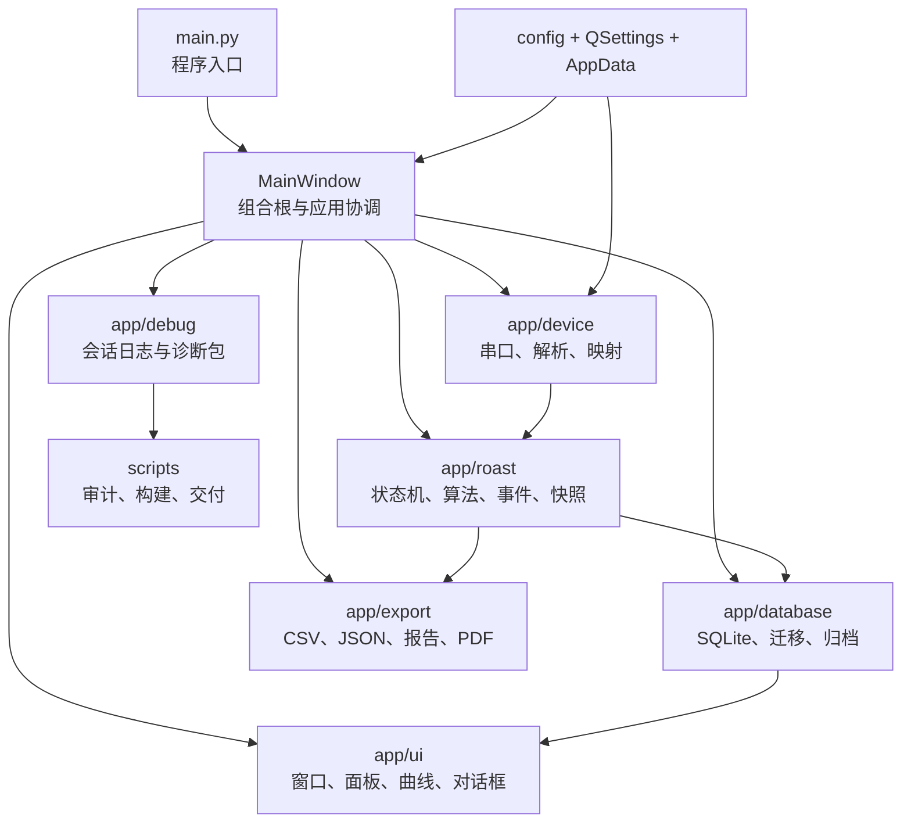
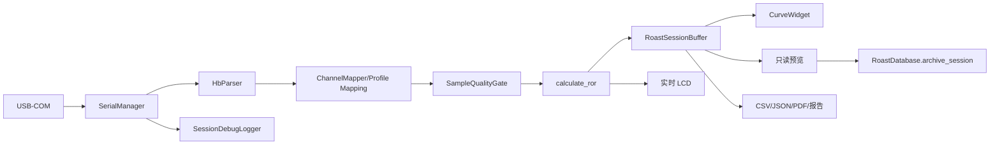
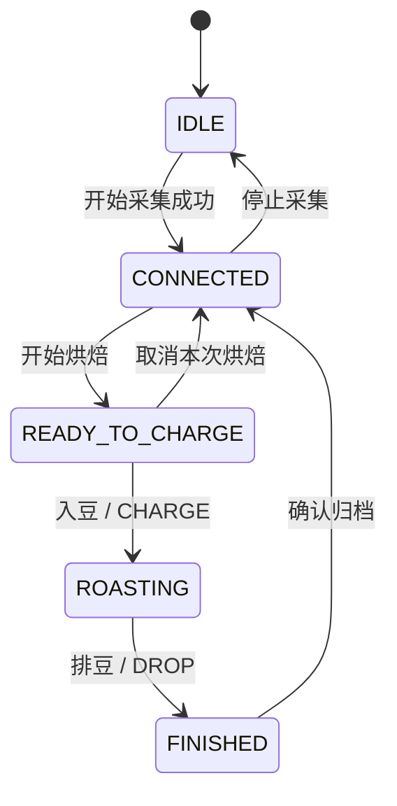

# 周周 ROAST 0.0.5 架构总览

## 1. 系统边界

周周 ROAST 是手动烘焙监测软件。系统负责读取、显示、计算、记录、归档和导出；不负责自动改变燃气、风门或滚筒转速。

- 输入：HB Model S USB-COM 温度帧、操作员按钮、批次资料和导入文件。
- 输出：实时 LCD、统一曲线、事件/操作记录、SQLite 锅次、CSV/JSON/PDF/报告和诊断 ZIP。
- 运行依赖：Windows、串口驱动、可执行程序；目标电脑不需要 Python 或 VS Code。

## 2. 分层结构

## 3. 核心运行链路

- 原始帧先解析、映射和质量判定，再进入 UI 与正式会话。
- 连接失败不会静默切换到模拟数据。
- 入豆前数据只用于实时预览，不写入正式锅次。
- 入豆时正式时间归零，RoR 正式窗口重新初始化。
- 排豆后不再追加正式样本，但串口可继续显示实时温度。
- 归档前构建脱离式快照，确认后一次事务写入。

## 4. 操作状态机

`RoastFlowState` 是当前操作员状态；`RoastStage` 仍保留 `IDLE/ROASTING/AWAIT_END/BETWEEN` 供旧展示与兼容逻辑使用。双状态模型是当前已知维护风险。

## 5. 模块职责

| 层 | 模块 | 主要职责 | 主要依赖 |
|---|---|---|---|
| 入口 | `main.py` | 初始化 Qt、工作目录、数据库与主窗口 | `app.ui`、`app.utils` |
| 设备 | `device.serial_manager` | 连接、读取线程、Model S 请求、模拟源、断开 | pyserial、Qt、parser |
| 设备 | `device.hb_parser` | JSON、键值、三/四路数字帧解析与证据字段 | Python 标准库 |
| 设备 | `device.channel_mapping` | CH 到业务温度映射、完整性和签名 | paths、JSON |
| 领域 | `roast.workflow` | 5 态操作流、兼容阶段、会话内存缓冲 | events |
| 领域 | `roast.ror` | 多温度通道 RoR 计算与兼容键 | 数值样本 |
| 领域 | `roast.sample_quality` | 无效值、尖峰和来源质量门 | 样本流 |
| 领域 | `roast.events/actions` | 事件顺序、撤销、人工参数规范化 | workflow/database |
| 领域 | `roast.compare/analysis` | TP、发展期、曲线指标和分析提示 | 样本/事件 |
| 领域 | `roast.preview/configuration` | 只读预览、配置副本、差异与生效时机 | workflow |
| 存储 | `database.migration` | SQLite schema 创建与升级 | sqlite3 |
| 存储 | `database.database` | 旧模型兼容、新 charges/batches 原子归档和查询 | events、sqlite3 |
| UI | `ui.main_window` | 应用组合、设备/领域/存储/导出协调 | 几乎全部应用模块 |
| UI | `ui.curve_widget` | 统一曲线、双轴、非负限制、自动跟随、事件与快照 | pyqtgraph |
| UI | 面板/对话框 | 事件、参数、状态、归档摘要、配置、回放和对比 | Qt、领域/数据库 |
| 导出 | `export.*` | CSV、JSON、文本报告和矢量 PDF | 领域快照、Qt PDF |
| 调试 | `debug.session_debug_logger` | JSONL、摘要、错误证据和诊断 ZIP | version、文件系统 |
| 工具 | `scripts.*` | 构建、UI 几何、日志审计和交付组装 | 应用模块、PyInstaller |

## 6. 数据模型

- 正式样本：时间、`bt/et/it/work`、各通道 RoR、原始 `CH1..CH4`、人工参数和来源审计字段。
- 事件：`TP/CHARGE/YELLOW/FC_START/FC_END/SC_START/SC_END/DROP`。
- 人工操作：燃气压力、风门 `0-10`、滚筒转速 `0-10`、相对时间和备注。
- 新归档：`charges` 与 `batches` 快照模型，事务内原子写入。
- 兼容读取：旧 `roast_info/samples/events/manual_actions` 模型。
- 运行期：正式数据先保存在 `RoastSessionBuffer`，不逐点提交 SQLite。

## 7. 依赖方向约束

- 领域层不得依赖 Qt、串口或数据库。
- UI 可协调服务，但组件自身不应直接执行不可逆写入。
- 设备层只产生样本和状态，不决定业务事件。
- 数据库负责事务和查询，不计算 UI 指标。
- 导出只消费脱离式数据/曲线快照，不依赖屏幕像素。

当前例外：`CompareWindow`、`ReplayWindow` 直接读取数据库；`MainWindow` 承担过多协调职责；这些已列入改善报告。

