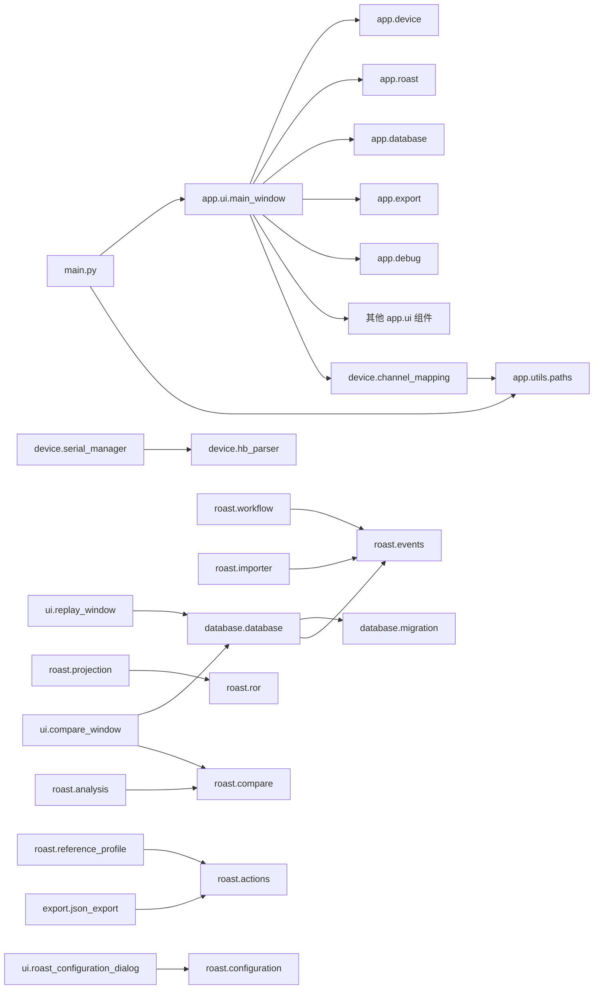
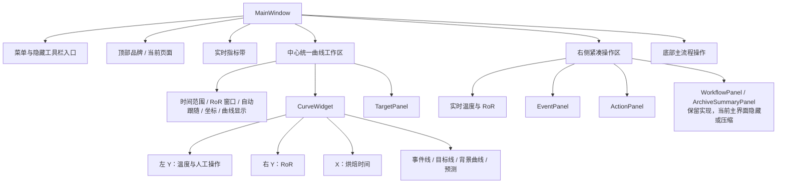
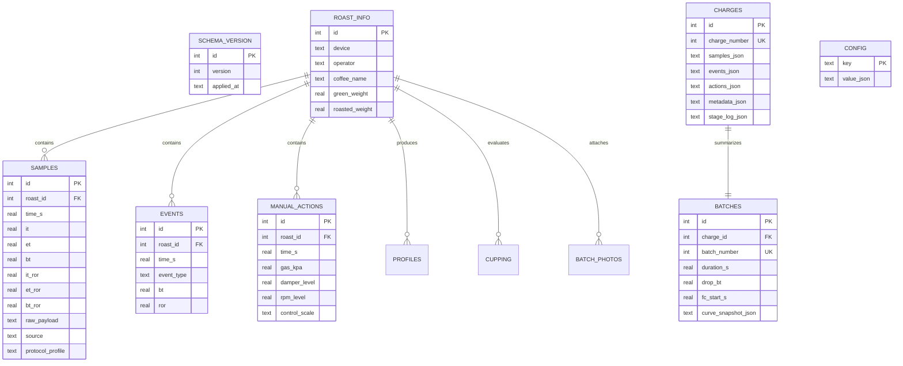
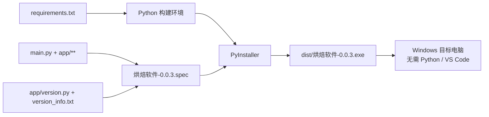

# 烘焙软件 0.0.3 程序开发逻辑图

## 1. 基线信息

| 项目 | 内容 |
|---|---|
| 基线版本 | 0.0.3 |
| 冻结日期 | 2026-08-28 |
| 程序类型 | Windows 桌面烘焙监控与记录软件 |
| 技术栈 | Python 3.12、PySide6、pyqtgraph、pyserial、NumPy、SQLite、PyInstaller |
| 程序入口 | `main.py` |
| 打包入口 | `烘焙软件-0.0.3.spec` 或 `scripts/build_exe.py` |
| 主要持久化 | SQLite `.hbroast`、Qt `QSettings`、JSON 通道配置、JSONL 调试日志 |
| 审查性质 | 基于当前源码、测试契约和构建配置的静态架构审查 |

本文档与《02-程序主要流程图》《03-模块设计说明》共同构成 0.0.3 框架冻结基线。图中的“应用编排层”目前由 `MainWindow` 实际承担，并非独立服务层。

## 2. 整体分层架构

```mermaid
flowchart TB
    subgraph Entry[入口与运行环境]
        MAIN[main.py\nQApplication / 工作目录初始化]
        PATHS[app.utils.paths\n数据与配置目录选择]
        VERSION[app.version\nAPP_VERSION = 0.0.3]
    end

    subgraph UI[表现层 app.ui]
        MW[MainWindow\n界面组合 + 应用编排]
        CURVE[CurveWidget\n统一曲线 / 双 Y 轴]
        EVENT[EventPanel\n烘焙事件]
        ACTION[ActionPanel\n燃气 / 风门 / 转速]
        TARGET[TargetPanel\n目标温度 / ETA]
        AXIS[AxisSettingsDialog\n坐标控制台]
        PREVIEW[PreviewCenterDialog\n写入前预览与确认]
        SECONDARY[Replay / Compare / Config / Batch dialogs]
        STATUS[WorkflowPanel / ArchiveSummaryPanel]
    end

    subgraph App[应用编排与会话状态]
        WF[RoastWorkflow\n纯状态机]
        BUFFER[RoastSessionBuffer\n内存样本 / 事件 / 操作]
        CFG[RoastConfigurationState\n当前 / 待生效配置]
        QUALITY[SampleQualityGate\n数据质量门]
    end

    subgraph Domain[烘焙领域层 app.roast]
        EVENTS[events\n事件合法性与顺序]
        ROR[ror / projection\nRoR 与趋势预测]
        METRICS[compare / analysis / milestone_forecast\nTP、阶段指标、目标 ETA]
        PROFILE[reference_profile / replay\n参考曲线与回放]
        IMPORTER[importer / preview / actions\n导入、预览、人工操作]
    end

    subgraph Device[设备采集层 app.device]
        SERIAL[SerialManager\n串口线程 / 模拟定时器]
        PARSER[HbParser\n文本帧解析]
        MAPPER[ChannelMapper\n物理通道到业务通道]
    end

    subgraph Persistence[持久化与输出]
        DB[RoastDatabase\nSQLite 仓储]
        MIGRATE[migration\nSchema v3]
        EXPORT[CSV / JSON / Report / PDF]
        DEBUG[SessionDebugLogger\nJSONL + ZIP 诊断包]
    end

    subgraph Storage[外部资源]
        COM[USB-COM 烘焙机]
        SQLITE[(default.hbroast)]
        CHANNEL[(channel.json)]
        SETTINGS[(QSettings)]
        FILES[(CSV / JSON / TXT / PDF / ZIP)]
    end

    MAIN --> PATHS
    MAIN --> MW
    VERSION --> MW
    MW --> CURVE
    MW --> EVENT
    MW --> ACTION
    MW --> TARGET
    MW --> AXIS
    MW --> PREVIEW
    MW --> SECONDARY
    MW --> STATUS
    MW --> WF
    MW --> BUFFER
    MW --> CFG
    MW --> QUALITY
    MW --> SERIAL
    MW --> MAPPER
    MW --> DB
    MW --> EXPORT
    MW --> DEBUG
    SERIAL --> PARSER
    COM <--> SERIAL
    MAPPER <--> CHANNEL
    WF --> EVENTS
    MW --> ROR
    MW --> METRICS
    MW --> PROFILE
    MW --> IMPORTER
    DB --> MIGRATE
    DB <--> SQLITE
    CFG <--> SETTINGS
    EXPORT --> FILES
    DEBUG --> FILES
```



## 3. 包与模块依赖关系



依赖方向基线：

- `app.roast` 不依赖 Qt、串口或数据库；它是可独立测试的领域逻辑层。
- `app.device` 只依赖 QtCore 信号、pyserial、解析器和路径工具，不依赖界面控件。
- `app.database` 依赖事件校验，但不依赖界面。
- `app.export` 接收普通字典、列表或曲线快照，不负责业务状态转换。
- `app.ui.main_window` 是最高层组合根，直接依赖几乎所有功能包。
- `CompareWindow` 和 `ReplayWindow` 直接访问数据库，未经过独立查询服务。

## 4. 运行时数据通路

```mermaid
sequenceDiagram
    participant Machine as HB Model S / COM
    participant Serial as SerialManager
    participant Parser as HbParser
    participant Main as MainWindow
    participant Mapper as ChannelMapper
    participant Gate as SampleQualityGate
    participant ROR as calculate_ror / predict_ror
    participant Buffer as RoastSessionBuffer
    participant Chart as CurveWidget
    participant Log as SessionDebugLogger
    participant DB as RoastDatabase

    Main->>Serial: connect(port, baudrate, profile)
    alt HB_MODEL_S
        loop 采集线程持续运行
            Serial->>Machine: CHAN;1200 + READ
            Machine-->>Serial: 三数值文本帧
            Serial->>Machine: CHAN;3400 + READ
            Machine-->>Serial: 三数值文本帧
            Serial-->>Main: sample_received(四路原始温度及审计元数据)
        end
    else HB_TC4 / HB_LEGACY_3
        loop 采集线程持续运行
            Serial->>Machine: READ
            Machine-->>Serial: JSON / 键值 / 数字文本帧
            Serial->>Parser: parse(raw, profile)
            Parser-->>Serial: 规范化原始通道
            Serial-->>Main: sample_received(parsed)
        end
    else SIMULATION
        Serial-->>Main: QTimer 生成显式模拟样本
    end

    Main->>Mapper: map_sample(raw)
    Mapper-->>Main: it / et / bt / work
    Main->>Gate: accept(sample)
    Gate-->>Main: accepted / rejected + reason
    alt 样本有效
        Main->>ROR: 计算当前 RoR 与 30 秒预测
        Main->>Buffer: append(sample)
        Main->>Chart: set_data / set_events / set_actions
        Main->>Log: log_sample(accepted=True)
    else 样本无效
        Main->>Log: sample_reject
    end
    Note over Buffer,DB: 烘焙中仅保存在内存；用户确认结束后才原子归档
    Main->>DB: archive_session(snapshot, metadata)
```

## 5. UI 组合结构



## 6. 数据存储关系



数据库存在两组并行数据模型：

- 旧式可逐行写入模型：`roast_info`、`samples`、`events`、`manual_actions` 及其关联表。
- 当前会话归档模型：`charges` 保存完整不可分割快照，`batches` 保存展示和检索摘要。

当前主烘焙流程在用户确认前只写 `RoastSessionBuffer`，确认后调用 `archive_session()`，在同一 SQLite 事务内同时写入一条 `charges` 和一条 `batches`。

## 7. 构建与发布链



当前 spec 使用 `collect_all('PySide6')` 和 `collect_all('pyqtgraph')`，生成单文件、无控制台窗口的 Windows EXE。

## 8. 架构冻结边界

以下内容属于本基线的架构级约束：

- 程序入口、工作目录回退策略和版本来源。
- `MainWindow` 作为现有组合根的依赖关系。
- `RoastWorkflow` 四阶段状态机及其转换条件。
- 样本处理顺序：解析或组帧、通道映射、质量门、RoR、内存缓冲、界面刷新。
- Model S 的 `CHAN;1200`、`CHAN;3400`、`READ` 文本命令采集方式。
- IT、ET、BT 使用左轴，RoR 使用右轴，人工操作使用左轴的统一曲线语义。
- 写入前预览确认、锅次结束后原子归档、连接失败不自动切换模拟数据。
- SQLite Schema v3、旧式表与快照归档表并存的兼容策略。

任何改变以上边界的开发任务，都应同步更新三份基线文档及对应测试契约。
