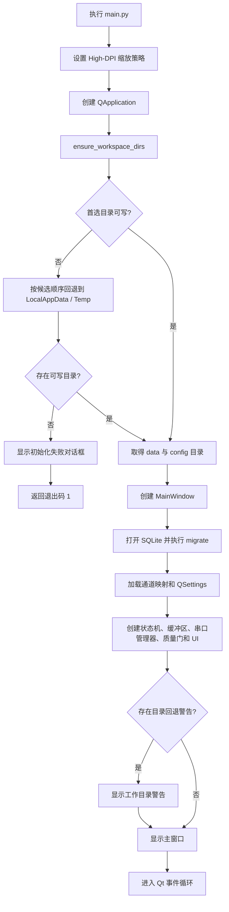
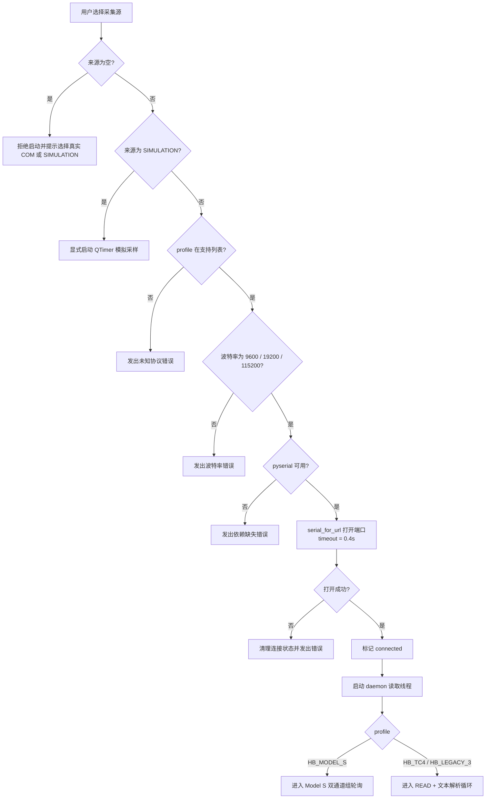
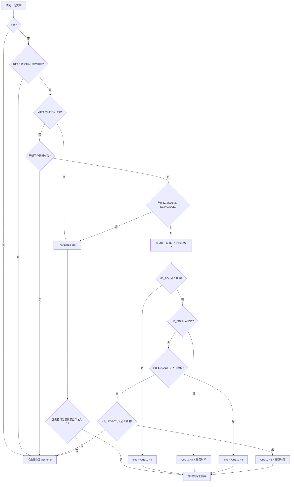
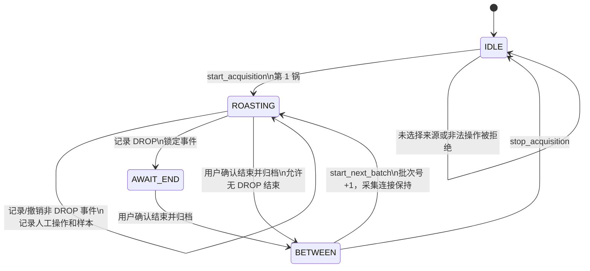
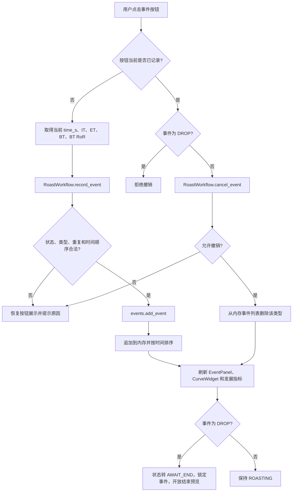
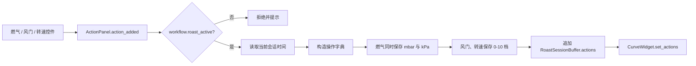
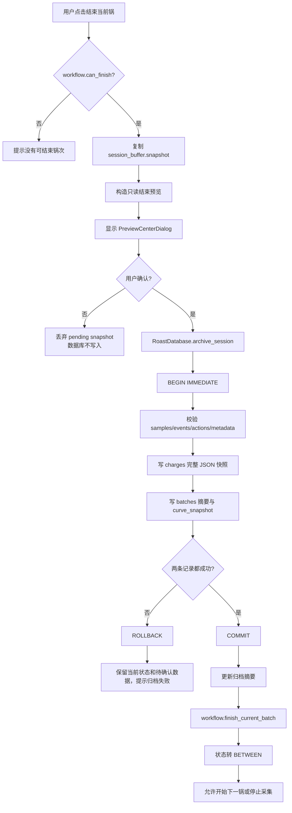
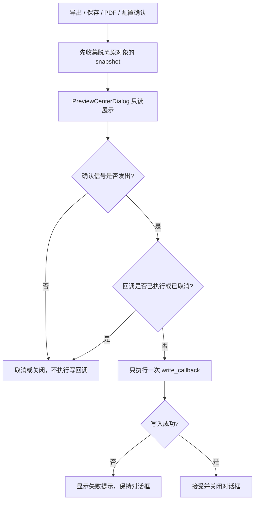
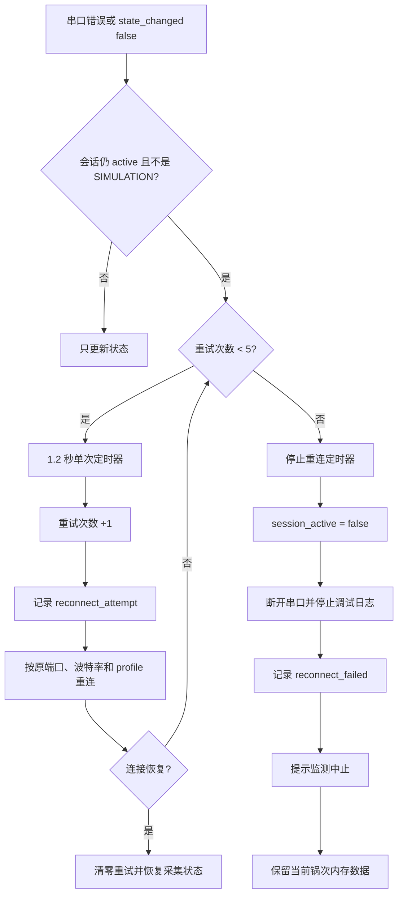
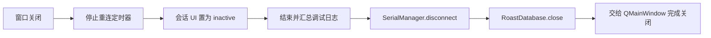

# 烘焙软件 0.0.3 程序主要流程图

## 1. 程序启动流程



启动异常路径：

- 缺少 PySide6 时，入口直接终止并提示安装依赖。
- 所有候选数据目录均不可写时，显示致命错误并返回 `1`。
- 数据库初始化时自动执行幂等迁移；已有字段导致的 `ALTER TABLE` 错误被视为已迁移并忽略。

## 2. 采集源选择与连接流程



关键约束：模拟数据只能由用户显式选择；真实端口连接或重连失败时不得静默降级为模拟数据。

## 3. HB Model S 温度采集循环

```mermaid
flowchart TD
    A[读取线程 _read_loop] --> B{running 且 serial 存在?}
    B -- 否 --> Z[退出线程]
    B -- 是 --> C[reset 输入/输出缓冲]
    C --> D[发送 CHAN;1200 + LF]
    D --> E[等待 0.1 秒并读取确认]
    E --> F{确认为空或以 # 开头?}
    F -- 否 --> G[记录 CHAN 确认异常]
    F -- 是 --> H[继续]
    G --> H
    H --> I[发送 READ + LF]
    I --> J[等待 0.1 秒并读取三数值帧]
    J --> K{至少三个有限数字?}
    K -- 否 --> L[记录解析错误并放弃本轮]
    K -- 是 --> M[得到第一组 first]
    M --> N[用相同步骤请求 CHAN;3400]
    N --> O{第二组有效?}
    O -- 否 --> L
    O -- 是 --> P[组合四路业务原始数据]
    P --> Q[AT_RAW = first[0]]
    Q --> R[IT_RAW = first[2]]
    R --> S[CH4 = first[1]]
    S --> T[BT_RAW = second[1]]
    T --> U[ET_RAW = second[2]]
    U --> V[附加 SERIAL、端口、波特率、profile、原始帧和错误计数]
    V --> W[emit sample_received]
    W --> B
```

当前实现是串口文本命令轮询，不是 Modbus RTU/TCP。代码未构造 Modbus 功能码、站号、寄存器地址或 CRC。

## 4. 普通文本帧解析流程



## 5. 单个样本的核心处理流程

```mermaid
flowchart TD
    A[sample_received(raw)] --> B{workflow.acquisition_active?}
    B -- 否 --> Z[忽略]
    B -- 是 --> C[ChannelMapper.map_sample]
    C --> D{映射完整、无冲突且数值有限?}
    D -- 否 --> E[记录 sample_reject: channel_mapping]
    E --> Z
    D -- 是 --> F[合并原始审计字段与 it/et/bt/work]
    F --> G[SampleQualityGate.accept]
    G --> H{时间递增、温度在 -30..350、短时变化率 <= 80 C/min?}
    H -- 否 --> I[记录 sample_reject: 具体原因]
    I --> Z
    H -- 是 --> J[生成 time_ms 和 channel_mapping 文本]
    J --> K[calculate_ror: 最近窗口加权线性拟合]
    K --> L[写入 it_ror / et_ror / bt_ror 及兼容别名]
    L --> M[记录 accepted sample 调试日志]
    M --> N[追加到 RoastSessionBuffer.samples]
    N --> O[predict_ror: 未来 30 秒]
    O --> P[CurveWidget.set_data]
    P --> Q{自动 TP 开启且当前未记录 TP?}
    Q -- 是 --> R[detect_tp]
    R --> S{检测到回温点?}
    S -- 是 --> T[记录 TP 到内存]
    S -- 否 --> U[继续]
    Q -- 否 --> U
    T --> U[刷新实时指标、目标 ETA、发展阶段指标]
```

RoR 算法：

- 只取 `last_time - window` 之后的有效点。
- 按时间排序并合并同时间戳样本。
- 使用 NumPy 一次线性拟合，权重从 `0.35` 递增到 `1.0`，使新样本权重更高。
- 拟合斜率乘以 `60`，输出单位为 `°C/min`。
- 点数不足、时间无效或拟合失败时返回 `None`。

## 6. 烘焙会话状态机



状态含义：

| 状态 | 采集 | 记录事件 | 结束当前锅 | 开始下一锅 | 停止采集 |
|---|---:|---:|---:|---:|---:|
| `IDLE` | 否 | 否 | 否 | 否 | 已停止 |
| `ROASTING` | 是 | 是 | 是 | 否 | 否，必须先结束锅次 |
| `AWAIT_END` | 是 | 否 | 是 | 否 | 否 |
| `BETWEEN` | 是 | 否 | 否 | 是 | 是 |

## 7. 事件记录、撤销与刷新流程



同一事件类型只能保留一条。按钮第一次按下记录，第二次按下撤销；撤销后再次按下会按当前时间重新记录。`DROP` 一旦记录不可撤销。

## 8. 人工操作记录流程



## 9. 结束锅次与原子归档流程



## 10. 写入前确认门流程



PDF 额外前置条件：当前烘焙已结束，或已载入背景/参考曲线。PDF 使用 Qt 矢量绘制当前可见曲线、坐标范围、事件线、目标线和图例，不依赖屏幕截图。

## 11. 断线重连与异常路径



主要异常处理基线：

| 异常点 | 处理方式 | 数据影响 |
|---|---|---|
| 串口打开失败 | 发出错误，进入有限重连 | 不切换模拟；内存锅次保留 |
| 半帧、空帧、字段不足 | 记录解析错误并跳过 | 不进入样本缓冲 |
| 通道映射冲突 | 记录拒绝原因并跳过 | 不污染曲线与归档 |
| 温度越界或尖峰 | 质量门拒绝 | 不污染曲线与归档 |
| 事件顺序冲突 | 抛出 `WorkflowError` 并恢复 UI | 事件列表不变 |
| 归档任一步失败 | SQLite 回滚 | `charges` 与 `batches` 均不产生半条记录 |
| 导出回调失败 | 显示警告 | 对话框不标记成功 |
| 应用关闭 | 停止重连、日志、串口并关闭数据库 | 已确认数据保留；未归档内存会话不会自动写入 |

## 12. 应用关闭流程


